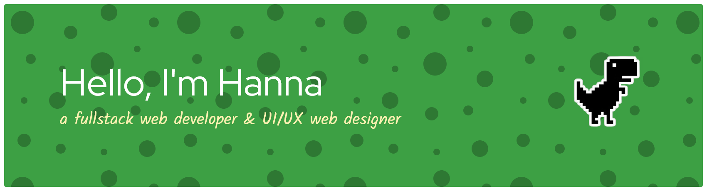
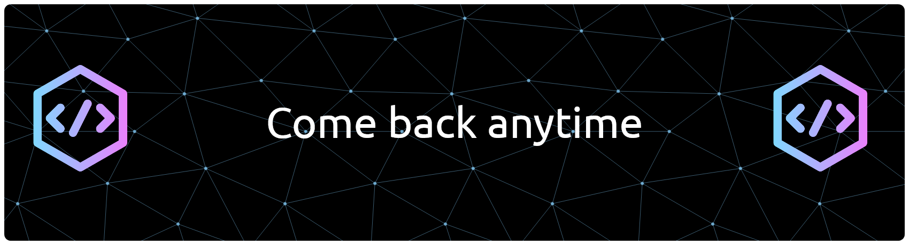

<link rel="stylesheet" type='text/css' href="https://cdn.jsdelivr.net/gh/devicons/devicon@latest/devicon.min.css" /> 

I am a web developer dedicated to crafting efficient, scalable, and user-centered digital solutions. With a strong foundation in modern web technologies and a continuous drive for improvement, I strive to deliver clean code and thoughtful design in every project I undertake.

My approach combines technical precision with creative problem-solving, ensuring that each application not only performs well but also provides a meaningful experience for its users. I value collaboration, clear communication, and lifelong learning as essential components of successful development.

Thank you for visiting my profile — I look forward to connecting and building impactful solutions together.

 
  
  

---

  <h1>Proficient in...</h1>
  <i class="devicon-javascript-plain" style="font-size:3rem;color:#34994aff;margin:.5rem"></i>
  <i class="devicon-typescript-plain" style="font-size:3rem;color:#34994aff;margin:.5rem"></i>
  <i class="devicon-git-plain" style="font-size:3rem;color:#34994aff;margin:.5rem"></i>
  <i class="devicon-mysql-original" style="font-size:3rem;color:#34994aff;margin:.5rem"></i>
  <i class="devicon-mongodb-plain" style="font-size:3rem;color:#34994aff;margin:.5rem"></i>
  <i class="devicon-mongoose-original-wordmark" style="font-size:3rem;color:#34994aff;margin:.5rem"></i>

  <h1>Frameworks & Libraries I use</h1>
  <i class="devicon-react-original" style="font-size:4rem;color:#34994aff;margin:.5rem"></i>
  <i class="devicon-express-original" style="font-size:4rem;color:#34994aff;margin:.5rem"></i>
  <i class="devicon-nodejs-plain-wordmark" style="font-size:4rem;color:#34994aff;margin:.5rem"></i>
  <i class="devicon-vitejs-plain" style="font-size:4rem;color:#34994aff;margin:.5rem"></i>
  <i class="devicon-tailwindcss-original" style="font-size:4rem;color:#34994aff;margin:.5rem"></i>

  <h1>Currently studying</h1>
  <i class="devicon-csharp-plain" style="font-size:4rem;color:#34994aff;margin:.5rem"></i>
  <i class="devicon-reactnative-original-wordmark" style="font-size:4rem;color:#34994aff;margin:.5rem"></i>
  <i class="devicon-postgresql-plain-wordmark" style="font-size:4rem;color:#34994aff;margin:.5rem"></i>
  <i class="devicon-bootstrap-plain" style="font-size:4rem;color:#34994aff;margin:.5rem"></i>
  <i class="devicon-sass-original" style="font-size:4rem;color:#34994aff;margin:.5rem"></i>

---
